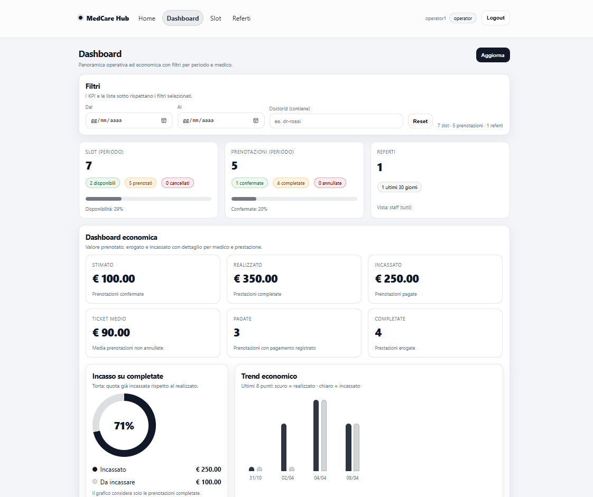
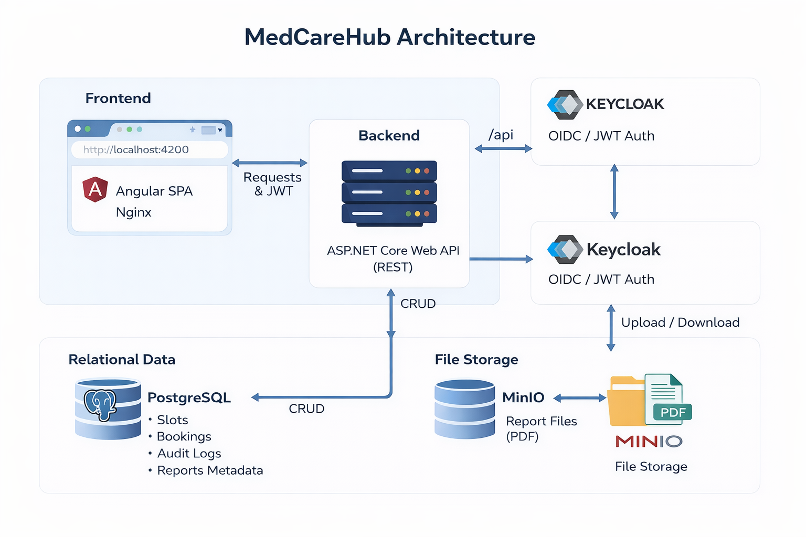

# MedCareHub

Full-stack API-based healthcare MVP for clinic/polyclinic workflows.

<center></center>

## Scope
- Slot management
- Patient bookings
- Clinical report upload/download
- Operational and economic dashboard
- Reproducible local runtime with Docker Compose

## Stack
- Backend: ASP.NET Core Web API (.NET 8), EF Core, PostgreSQL
- Frontend: Angular SPA, Nginx
- Identity: Keycloak (OIDC/JWT, RBAC)
- File storage: MinIO (S3-compatible)
- Runtime: Docker Compose

<center></center>

## Core Features
- RBAC: `patient`, `operator`, `doctor`, `admin`
- Double-booking protection on bookings
- Overlap prevention for slots of the same doctor
- Report access with ownership/staff checks
- PDF-only report upload
- Audit logging for relevant operations
- Economic tracking with `BasePrice`, `BookedPrice`, `PaymentStatus`, `PaidAt`
- Staff dashboard with operational and economic KPIs
- Backend unit tests

## Services
- Web: `http://localhost:4200`
- API: `http://localhost:8080`
- Swagger: `http://localhost:8080/swagger`
- Keycloak: `http://localhost:8081`
- MinIO: `http://localhost:9000` (console `:9001`)
- PostgreSQL: `localhost:5432`

## Quick Start
### Infrastructure only
```bash
docker compose up -d
```

### Full stack
```bash
docker compose --profile full up -d --build
```

### Full stack teardown
```bash
docker compose --profile full down
```

## Demo Users
- `patient1 / Password!23`
- `operator1 / Password!23`
- `doctor1 / Password!23`
- Keycloak admin: `admin / admin`

## Main Endpoints
### Slots
- `GET /api/slots`
- `POST /api/slots`

### Bookings
- `POST /api/bookings`
- `GET /api/bookings/my`
- `DELETE /api/bookings/{id}`
- `POST /api/bookings/{id}/complete`
- `POST /api/bookings/{id}/mark-paid`

### Reports
- `POST /api/reports/upload`
- `GET /api/reports/my`
- `GET /api/reports/{id}/download`

### Analytics
- `GET /api/analytics/economics`

## Local Development
### Backend
```bash
cd backend/src/MedCareHub.Api
dotnet restore
dotnet run
```

### Frontend
```bash
cd frontend
npm install
npm start
```

## Tests
```bash
dotnet test tests/MedCareHub.Api.Tests/MedCareHub.Api.Tests.csproj
```

## Notes
This project is intended for academic/demo use, not production deployment without further hardening, monitoring, and compliance work.
